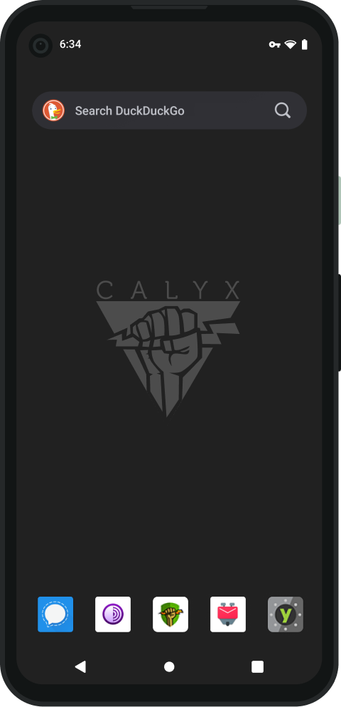

# CalyxOS

## Broken Apps


If you like my work, [**❤️ Sponsor Me**](https://github.com/sponsors/marbetschar). It would mean the world to me!


### Maps and Location

#### [SBB Mobile App](https://play.google.com/store/apps/details?id=ch.sbb.mobile.android.b2c&hl=en_US&gl=US)

Resolving current location does not work. Although this is not a deal breaker, it is certainly an inconvenience.
Having the app automatically determine the current location in order to select the source or destination of traveling
makes dealing with the app significantly faster.

**Action taken**

Sent an email to the customer support.

**Outcome**

The customer support responded with the following message (original in German, translated to English):

> Dear Mr Betschart
>
> Thank you very much for your inquiry.
>
> We support only SBB Mobile app versions downloaded using the official Google PlayStore (Android) or App Store (iOS).
> For any other sources we don't provide any guarantees. Alternatives are not planned.
>
> Best regards

#### [Vertical-Life Climbing App](https://www.vertical-life.info/)

 Discover does not show anything on the map

**Action taken**

Sent an email to the Vertical-Life customer support.

**Outcome**

The customer support responded with the following message:

> Hello Marco,
>
> Thank you for your message and the detailed explanation of your issue. Please keep in mind that we only support phones with google services installed.
> If you don’t have a change to register with Google, we would be happy to refund you the subscription. Please let me know.
>
> Kind regards