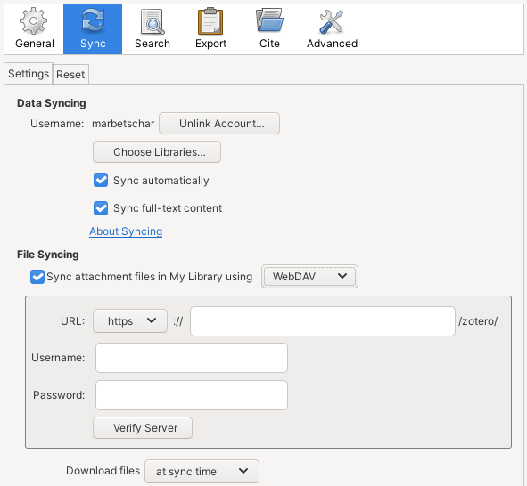
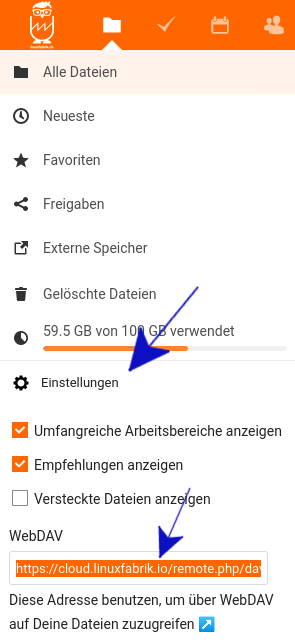

---
tags:
  - knowledge-management
  - growth
  - learn
  - linux-desktop
  - nextcloud
description: How I setup Zotero to store My Library.
---

# Howto setup Zotero


If you like my work, [**❤️ Sponsor Me**](https://github.com/sponsors/marbetschar). It would mean the world to me!


## Installation

The easiest way to install the latest Zotero on Ubuntu is to use Flatpak. If you are on elementary OS, its really easy to install: Just head over to [Zotero on Flathub](https://flathub.org/apps/details/org.zotero.Zotero), click the Install button and when your browser prompts you, select `Open with: Sideload`.

## Setup Syncing

Once you installed Zotero, we need to setup the library sync. To do so, start Zotero and go to `Edit > Settings > Sync`, enter your Username and Password click `Set Up Syncing`.

### Sync attachment files in My Library with WebDAV

Once you are succesfully connected, we now need to setup syncing of attachment files with your Nextcloud backend. This can be done in `Edit > Preferences > Sync` as well. Just make sure you select `✓ Sync attachment files in My Library using: WebDAV` and enter your Nextcloud server details in the shown form:

Make sure you use the right WebDAV URL by copying it from the Nextcloud web interface:

## Zotero Connector

As last step, you want to install the Zotero Connector. It makes it easy to add interesting stuff to your library right from your web browser. For installation, [visit the download page of the official Zotero website](https://www.zotero.org/download/) and click `Install Connector`.

**PLEASE NOTE:** Zotero needs to be running for the Connector to work properly.

## ZotMoov Extension

Install the ZotMoove extension from [its GitHub repository](https://github.com/wileyyugioh/zotmoov). Then restart Zotero and configure the extension in `Edit > Settings > ZotMoov`:

* `ZotMoov`:
  * Directory to Move Files To: `~/Nextcloud/Leseraum`
* `Other Settings`
  * File Behavior: `Move`
  * **Disable** Automatically Move/Copy Files When Added
  * **Enable** Automatically Move/Copy Files to Subdirectory
    * `Subdirectory String:` **\{%T}**

Now you can move attachments to and from `~/Nextcloud/Leseraum` simply by using right click and `ZotMoov: Move Selected to Directory` or `ZotMoov: Move Selected from Directory`.

## BetterBibTex Extension

Install the BetterBibTex extension and [configure it according to the Zettlr docs](https://docs.zettlr.com/en/academic/citations/). It should export the library to `~/Nextcloud/Notes/assets/Library.json`
