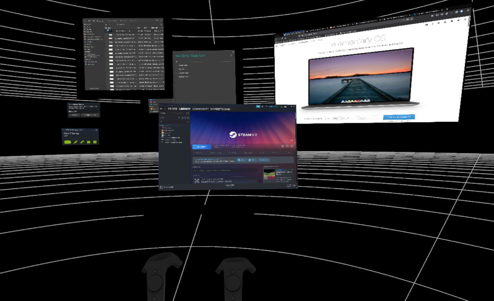

# Dipping elementary OS' toes into Virtual Reality

_April 2021_


If you like my contributions, [**❤️ Sponsor Me**](https://github.com/sponsors/marbetschar). It would mean the world to me!


## What already works

## How is it done?

## What's next