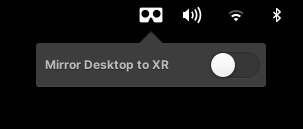

# Dipping elementary OS' toes into Virtual Reality

_April 2021_


If you like my contributions, [**❤️ Sponsor Me**](https://github.com/sponsors/marbetschar). It would mean the world to me!


## What already works

Thanks to the [plugin I wrote](https://github.com/elementary/gala/pull/1095) to support [xrdesktop](https://www.collabora.com/news-and-blog/news-and-events/xrdesktop-014-with-openxr-support-released.html) in elementary's window manager "Gala", we are now able to mirror desktop windows to Virtual or Augmented Reality. Although the support is still in a very early stage, its already possible to interact with the windows using the Virtual Reality Controllers and doing some re-positioning stuff. On the other hand, mouse or keyboard interaction is not possible as of now and the current state has been tested in SteamVR using a HTC Vive only.

## How is it done?

Mirroring the elementary OS desktop to Virtual Reality needs three pieces to work together:

1. [A user facing toggle to enable or disable VR mirroring](https://github.com/marbetschar/wingpanel-indicator-xrdesktop)
2. The possibility to adjust some settings on how the mirroring should work
3. [The actual mirroring of the desktop windows](https://github.com/elementary/gala/pull/1095)

As of now, I worked on 1. and 2. So we have a neat [Wingpanel indicator](https://github.com/marbetschar/wingpanel-indicator-xrdesktop) which allows us to enable/disable desktop mirroring to Virtual Reality:

In addition, the backend which does all the mirroring work [is developed as a Gala plugin](https://github.com/elementary/gala/pull/1095). Fortunately, there is a [reference implementation for the GNOME desktop environment](https://gitlab.freedesktop.org/xrdesktop/gnome-shell/-/blob/3.38.4-xrdesktop/src/shell-vr-mirror.c) available. So the main work was to translate the existing C code into Vala. To do so several VAPI's for the xrdesktop libraries were needed as well as doing some OpenGL stuff in Vala.

Thankfully, xrdesktop uses GObject. That means, we were able to build most of the [needed VAPI's](https://github.com/elementary/gala/tree/xrdesktop/vapi) automatically using [GObject Introspection](https://gi.readthedocs.io/en/latest/). Although there were some fixes needed upstream to get this running correclty \(in [gxr](https://gitlab.freedesktop.org/xrdesktop/gxr), [gulkan](https://gitlab.freedesktop.org/xrdesktop/gulkan) as well as in [xrdesktop](https://gitlab.freedesktop.org/xrdesktop/xrdesktop) itself\).

Big thanks also to [Maia Everett](https://github.com/Maia-Everett), who provided the awesome [ValaGL project on GitHub](https://github.com/Maia-Everett/valagl) - a jump start for OpenGL VAPI in Vala.

## What's next

### Mouse and keyboard support

Mouse and keyboard interaction is still missing. So this would be a natural next step to implement. Unfortunately, Gala uses `libmutter-6` to do so - wherelse xrdesktop only supports `libmutter-5` in [libinputsynth](https://gitlab.freedesktop.org/xrdesktop/libinputsynth). Another potential solution for this would be to [add Wayland support](https://gitlab.freedesktop.org/xrdesktop/libinputsynth/-/merge_requests/3#note_865770). However, this may lead to a bunch of other problems on elementary.

### User facing xrdesktop settings

There is no way a regular user can adjust xrdesktop's settings in elementary OS yet. I think the best way to do so, would be to develop a [Switchboard Plug](https://github.com/elementary/switchboard/) with the UI needed to tinker with the settings.

### Add support for Monado

[Monado](https://monado.dev/) is the reference runtime for the OpenXR specification. At the time I started development, SteamVR provided the better end user experience and was much more stable. Therefore I chose SteamVR over Monado to jump start initial work. However, in the long rung we really want to support open software - therefore getting things working on Monado is definitely something we need to work on.

