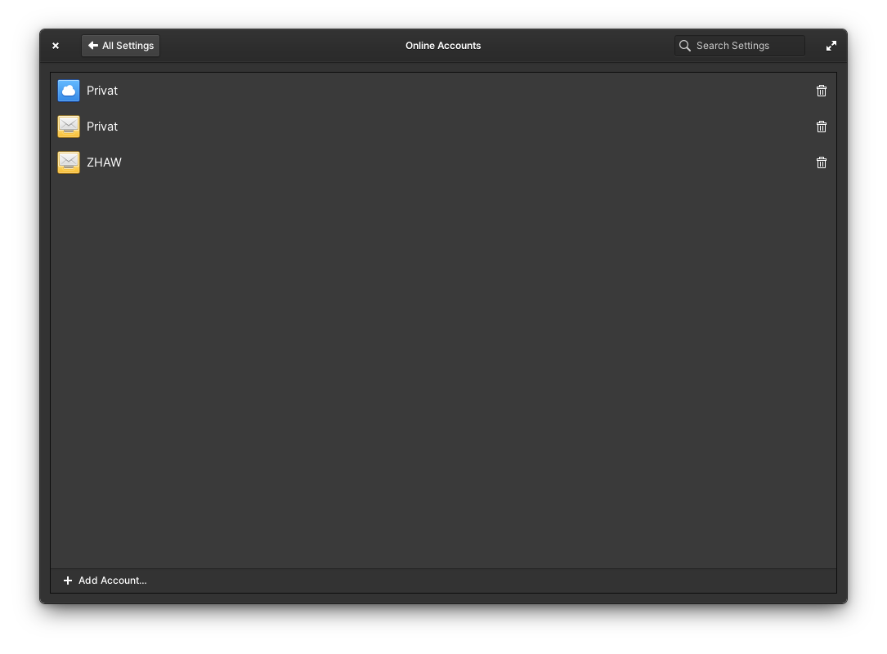

# elementary Online Accounts

_May 2021_


If you like my contributions, [**❤️ Sponsor Me**](https://github.com/sponsors/marbetschar). It would mean the world to me!


This month I've worked together with [Dan](https://github.com/danrabbit) on a long awaited feature and I'm very happy it made its way already into the elementary OS 6 Beta: The Online Accounts configuration page of the System Settings is finally here!

Although the current version is still early work, it already provides the essentials: The possibilities to configure calendar (which includes tasks as well) and mail accounts. This means, we are now no longer forced to install Evolution for initial configuration - which improves the overall elementary OS Desktop experience a LOT, especially for newcomers. It also means I can finally tick this off of my ["Missing Features & Workarounds" list for elementary](https://www.marco.betschart.name/areas/elementary-os/missing-features-and-workarounds#online-accounts).