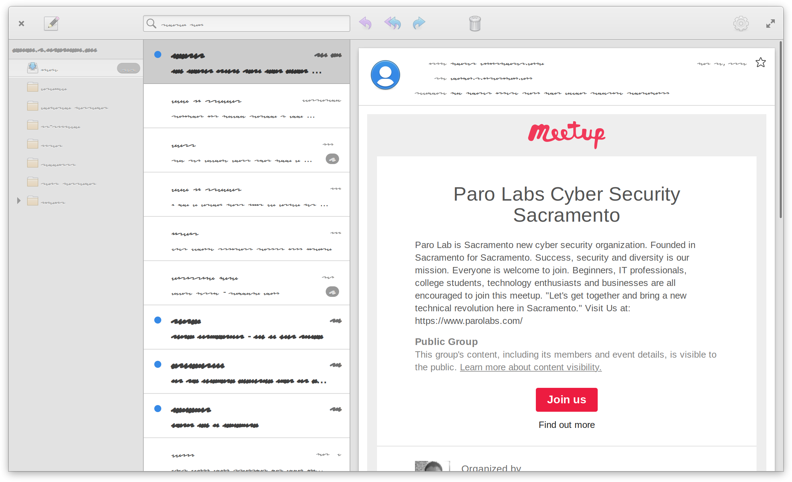

# A month dedicated to elementary Mail

_July 2021_

In case you are not aware yet: elementary Mail was rewritten from scratch to integrate with the local Evolution Data Server backend. This is the very same backend powering elementary Calendar and elementary Tasks. So, what exactly can you expect from my work this month?

### Support for Well Known Folders

Quite a few elementary Mail features rely well known folders such as `Inbox`, `Drafts`, `Archive` and `Sent`. That said, it is crucial to correctly detect those folders upon setup - otherwise parts of the user interface will not work as expected. It turned out, detecting those folders is quite a challenge since different mail providers adhere to different naming schemes. However, in the latest version of Mail [most of the folders should be recognized correctly most of the time](https://github.com/elementary/switchboard-plug-onlineaccounts/pull/192).


If you like my contributions, [**❤️ Sponsor Me**](https://github.com/sponsors/marbetschar). It would mean the world to me!


### Store copy of sent mail in Sent folder

Even though sending emails already worked in elementary Mail, it did not always store a copy of the sent mail in the `Sent` folder. I fixed this in the latest version of elementary Mail and you can now expect all sent mails to be stored correctly in the Sent folder - regardles off your mail provider. Please note: This was a non-issue for Office 365 and Gmail users.

### Handle reply subject

elementary Mail now [correctly displays the subject field](https://github.com/elementary/mail/pull/602) whenever you forward or reply to an email. In addition Mail does now [handle `Re:` subject prefixes correctly](https://github.com/elementary/mail/pull/603) whenever you hit the reply button.

### Save draft

Up until now, the new elementary Mail was not capable of saving a draft. Inevitably mails got lost because they were not sent. Now elementary Mail [automatically saves](https://github.com/elementary/mail/pull/599) the draft whenever you leave the compositor.

### Edit draft

Saving drafts is fine to avoid data loss. However, drafts are even more useful if they can be edited again. This feature is exactly what [my pull request #626](https://github.com/elementary/mail/pull/626) is going to add. Its not quite there yet, but its nearly done!

### Online Accounts: Verify credentials

And there is one more thing: The mail account setup in `System Settings > Online Accounts` now does [verify your IMAP/SMTP credentials _before_ they got stored](https://github.com/elementary/switchboard-plug-onlineaccounts/pull/189). So now you can be sure your mail account works correctly in elementary Mail, once the setup in Online Accounts is completed. This fixes a bunch of issues where users did not see any mails at all - even though Online Accounts (wrongly) claimed everything is fine.