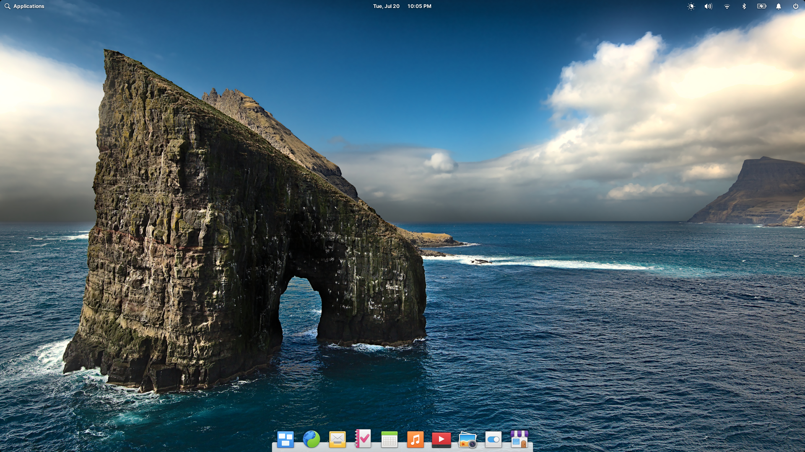

# elementary OS 6: Post Release Bugfixing


This is a draft and will most likely be changed.


_August 2021_

It's available: elementary OS 6 Odin was released earlier this month! Please see the [elementary blog](https://blog.elementary.io/elementary-os-6-odin-released/) for a complete overview on what's new.

Whenever new software is released, there are edge cases and bugs which slipped through. That's why I dedicated this month to squash bugs in the all new elementary OS 6 Odin.


**Please note:** Not all of the fixes described below are already released. Some are still undergoing testings and reviews. So it might take some more time till all of those are available to you.


## Mail

### Some mails did not load  \([\#655](https://github.com/elementary/mail/pull/655)\)

As you're maybe aware, calculating heights in the web is not always an easy task - and a wrongly calculated height was exactly the reason, why some mails did not render correctly in elementary Mail. Now, the height calculation is fixed and all mails show up as they should.

### Deleting mails sometimes doesn't work \([\#656](https://github.com/elementary/mail/pull/656)\)

Simply put: This was a timeout issue which is now fixed.

### Automatically select next message after delete \([\#660](https://github.com/elementary/mail/pull/660)\)

This little improvement automatically selects the next message in the list whenever the current one is deleted or archived. This way you can simply delete or archive one message after another, without tediously selecting each message by yourself.

### Sender was not always correct \([\#634](https://github.com/elementary/mail/pull/634)\)

If you configured multiple mail accounts, elementary Mail sometimes used the wrong account to send mails from. I fixed this wrong behaviour and also made sure you can see the `From:` input field while composing the message. This way you can be sure, your mail is sent from the correct account - and even switch to another one if you want to.

|  |  |
| :--- | :--- |


If you like my contributions, [**❤️ Sponsor Me**](https://github.com/sponsors/marbetschar). It would mean the world to me!


## Tasks

### Password not found

Some users claimed they were not able to access task lists after account configuration in `System Settings > Online Accounts`. Turned out we ran into sandboxing issues with Flatpak. Because solving this properly needs [some more serious engineering effort](https://github.com/elementary/switchboard-plug-onlineaccounts/issues/209), we are shipping Tasks as Debian package for now. This solves the issue these user's are facing.

### Avoid accidentally deleting a list \([\#279](https://github.com/elementary/tasks/pull/279)\)

Because the shortcut chosen to delete a task list was also triggered while editing a task item, it unfortunately lead to data loss in some cases. I deactivated the shortcut during task editing now, so this is no longer the case.

### Account header in sidebar is sometimes shown multiple times \([\#287](https://github.com/elementary/tasks/pull/287)\)

An issue while sorting the task lists caused the account name in the sidebar to be shown multiple times under certain circumstances. This is fixed now.

### Can't remove task description \([286](https://github.com/elementary/tasks/pull/286)\)

Whenever a task description was completely removed, the UI did not reflect this state correctly.

## System Settings: Online Accounts

### Auto detect auth mechanism \([\#211](https://github.com/elementary/switchboard-plug-onlineaccounts/pull/211)\)

Some users weren't able to add their mail accounts in `System Settings > Online Accounts`, because of the authentication method used under the hood. Online Accounts is capable to probe for authentication methods supported by the server and chooses the right one automatically.

### Edit Mail and CalDAV account \([\#208](https://github.com/elementary/switchboard-plug-onlineaccounts/pull/208), \#[216](https://github.com/elementary/switchboard-plug-onlineaccounts/pull/216)\)

It is now possible to edit an existing mail as well as calendar account in `System Settings > Online Accounts` \(\[\#208\]\).

### Ignore Calendar Subscriptions \([\#218](https://github.com/elementary/switchboard-plug-onlineaccounts/pull/218)\)

Synchronizing subscribed calendars threw an error under certain circumstances. Because there is no way for us to know the correct credentials for such calendar subscriptions, we are simply ignoring any subscriptions for now. In case you use subscriptions, you need to add those in the corresponding app.

## System Settings: Notifications

### Bypass Do Not Disturb \([\#84](https://github.com/elementary/switchboard-plug-notifications/pull/84)\)

And there is one last thing: I also worked on a feature allowing you to select specific apps which are allowed to bypass Do Not Disturb. This way you'll be able to fully focus on the task at hand by turning off all notifications - except those few you really rely on.

