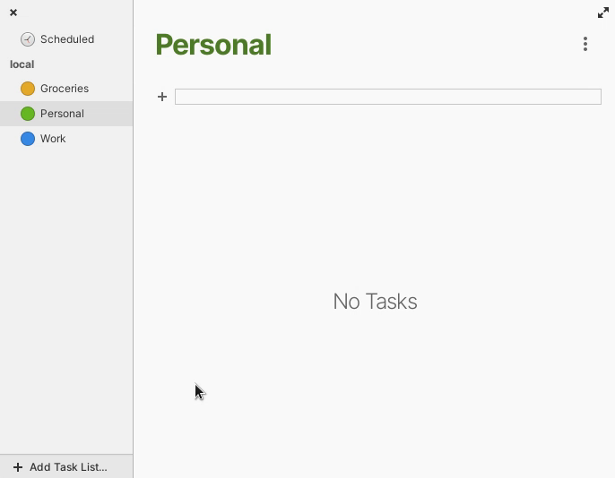

# elementary OS: Office Productivity Improvements

_September 2021_

Since elementary OS 6 was released in the beginning of August, traction all around elementary is really high. So make sure to also step by [the elementary blog](https://blog.elementary.io/) from time to time to stay up to date of what's happening!


**Please note:** Not all of the features described below are already released. Some are still undergoing testings and reviews. So it might take a little more time until those are available to you.


## Mail

[Once again](https://www.marco.betschart.name/blog/2021-07-25-a-month-dedicated-to-elementary-mail), I dedicated quite some time to elementary Mail. The result is a bunch of improvements:

Mail now notifies you about new messages \([\#679](https://github.com/elementary/mail/pull/679)\) and in case you feel like there is a message missing, you can manually refresh the currently selected folder at any time \([\#680](https://github.com/elementary/mail/pull/680)\).

Also the search feels much more responsive \([\#676](https://github.com/elementary/mail/pull/676)\) and on top of that, you are now even able to hide already read or un-starred conversations from the list \([\#678](https://github.com/elementary/mail/pull/678)\)[!](https://github.com/elementary/mail/pull/678]%29!)

Last but not least, the following two bug fixes also found their way into the latest version of Mail: It now stores messages only once in the "Sent" folder - even for outlook.com users \([\#702](https://github.com/elementary/mail/pull/702)\). Also it selects the next message automatically after you delete one - this lets you delete messages faster than ever before \([\#660](https://github.com/elementary/mail/pull/660)\)!

|  |  |
| :--- | :--- |


If you like my contributions, [**❤️ Sponsor Me**](https://github.com/sponsors/marbetschar). It would mean the world to me!


## Tasks

In the near future, it will be possible to drag and drop tasks to another list \([\#296](https://github.com/elementary/tasks/pull/296)\). For me, this addition is huge! The lack of it was my main reason why Tasks was _not quite usable_ - so I'm very excited about this one!

In addition to this new drag and drop feature, I also fixed two bugs:

First, Tasks now only loads non-completed tasks by default. This solves some performance issues users experienced \([\#295](https://github.com/elementary/tasks/pull/295)\).

Second, the cursor of the task description field is not correctly placed \([\#293](https://github.com/elementary/tasks/pull/293)\) - this improves usability and paves the way for a future integration of [HyperTextView](https://github.com/elementary/granite/pull/507) once it is released.

## Online Accounts

I refactored the calendars and task list discovery in Online Accounts, which solves issues with task list management for CalDAV backends \([\#227](https://github.com/elementary/switchboard-plug-onlineaccounts/pull/227)\). Additionally, Online Accounts now stores a refresh interval for IMAP accounts \([\#222](https://github.com/elementary/switchboard-plug-onlineaccounts/pull/222)\) - this enables us to make this configurable in the future.

## Calendar

As I was tinkering with notifications anyway, I fixed the missing icon bug for notifications in Calendar along the way \([\#702](https://github.com/elementary/calendar/pull/702)\).

