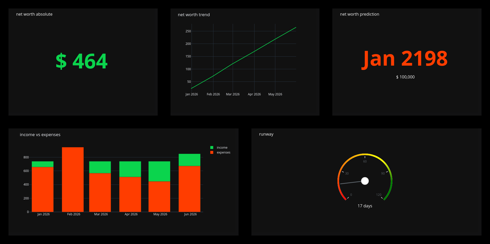

# GnuCash Dashboard

_October 2021_

The end is nigh - at least for the current year :smile: So I took the opportunity to rethink my personal finances and experiment with different - open source - accounting tools. The result of this effort is a personal finance dashboard which turns data from a local GnuCash file into a neat overview of your financial situation.

:::{seealso}
[**GnuCash**](https://gnucash.org) is a free and open source accounting software which has been around for decades. It is highly stable, actively maintained and supports double-entry accounting.
:::



You are free to use and modify the GnuCash Dashboard as you wish, because I released it under GPLv3 :tada: Simply head over to [its GitHub repository](https://github.com/marbetschar/GnuCash-Dashboard), hit the download button and you are ready to go!

> **Please Note:** The current state of work is tested on elementary OS 6 (based on Ubuntu 20.04 LTS). If you'd like to run the dashboard on another platform and run into issues, feel free to let me know in the [issues section of the GitHub repository](https://github.com/marbetschar/GnuCash-Dashboard/issues).

## Metrics

A lot of inspiration for the KPI's is drawn from [Michael Walker's approach](https://memo.barrucadu.co.uk/personal-finance.html) on personal finance.

### Net Worth Absolute

If I paid off all my liabilities right now, how much of my assets would remain?

```
net_worth = assets + liabilities
```

* 🟢 Good: Greater than 0.
* 🟠 Medium: Equals to 0.
* 🔴 Bad: Less than 0.

### Net Worth Trend

What is the net worth growth trend for the last n months?

```
net_worth_trend = linear_regression (assets_last_n_months + liabilities_last_n_months)

# Default: n months = 6
```

* 🟢 Good: Ascending slope (the steeper the better).
* 🟠 Medium: Straight slope.
* 🔴 Bad: Descending slope (the steeper the worse).

### Net Worth Prediction

If my net worth keeps growing at the current rate, when will I achieve a certain goal?

```
net_worth_predicted_at_date = extrapolate(net_worth_trend, until=goal)

# Default: goal = 100_000
```

* 🟢 Good: Less than 10 years.
* 🟠 Medium: 10 to 20 years.
* 🔴 Bad: More than 20 years.

### Income vs. Expenses

This should be pretty self explanatory. Defaults to the last 6 months.

### Runway

If my income stopped right now, how long would I be able to survive?

```
runway = assets / average_daily_expense_last_n_days

# Default: n days = 180
```

* 🟢 Good: More than 90 days.
* 🟠 Medium: 60 to 90 days.
* 🔴 Bad: Less than 60 days.
