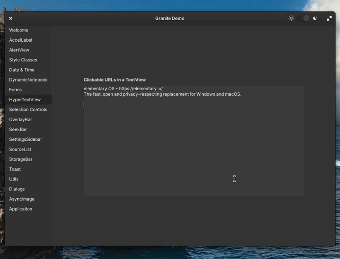
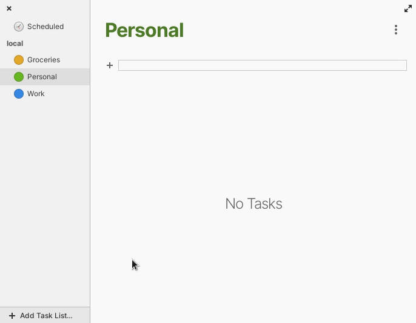

# It's Christmas Time: Jólnir brings many gifts

_December 2021_

Pretty sure you already heard the news: elementary OS 6.1 aka Jólnir is out! To get a full overview of what's new, read the [official announcement at the elementary blog](https://blog.elementary.io/elementary-os-6-1-available-now/).

In this post, I'm going to highlight some features I contributed to Jólnir and I'm very excited about: These contributions play a crucial part in my daily workflow - and all of them are now available to you as well! Merry Christmas!


If you like my contributions, [**❤️ Sponsor Me**](https://github.com/sponsors/marbetschar). It would mean the world to me!


## `Granite.HyperTextView`

[Back in June](2021-06-30-granite-hypertextview.md) I started to work on a new widget to enable hyperlinks in `Gtk.TextView`'s. After quite some discussion, testing and re-evaluation it is now finally released! This means, users can now simply `Control + Click` to follow web and email addresses in any text field. Which has already been integrated in Tasks and Calendar:



For developers its a no-brainer to add hyperlink support to their apps too, because `Granite.HyperTextView` is a drop-in replacement for `Gtk.TextView`:

```diff
- var description_textview = new Gtk.TextView ();
+ var description_textview = new Granite.HyperTextView ();
```

Yup - that's it. it's that easy! Just replace `Gtk.TextView` with `Granite.HyperTextView` and your done (requires Granite v6.2.0 or higher).

## Drag and Drop for Tasks

Pretty inconspicuous at first glance: You are now able to drag a task to another list. But this little gem is a huge improvement for the overall usability of Tasks. Its nothing less than a door opener for brand new workflows!



## Tasks alongside Events in Wingpanel

[This contribution](https://github.com/elementary/wingpanel-indicator-datetime/pull/252) goes back to March this year and I've been looking forward for this to land in elementary since day one of the Tasks app: Tasks are now shown alongside events in the calendar widget of Wingpanel. This feature makes planning in Jólnir both easier and more reliable than ever:

...

## Send by Email in Files

And last but not least: Its now possible again in elementary OS 6.1 to send files as email attachment by using the context menu in Files:

...