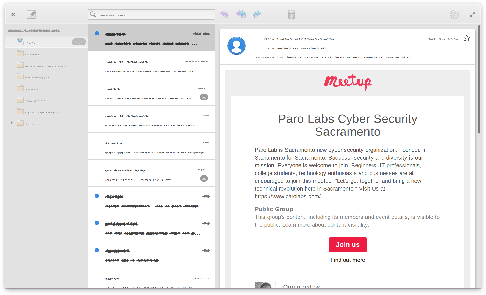

# elementary Mail v6

## Contributions


If you like my contributions, [**❤️ Sponsor Me**](https://github.com/sponsors/marbetschar). It would mean the world to me!


* [x] [~~**Re-Adding "Send by Email"**~~](https://github.com/elementary/files/pull/1822) 
* [x] [~~**Fix \#647: Cannot delete emails**~~](https://github.com/elementary/mail/pull/656) 
* [x] [~~**Manual Refresh**~~](https://github.com/elementary/mail/pull/680) 
* [x] [~~**Automatically select next message after delete**~~](https://github.com/elementary/mail/pull/660) 
* [x] [~~**Avoid storing to "Sent" twice for outlook.com**~~](https://github.com/elementary/mail/pull/702) 

[**more »**](../contributions.md#elementary-mail)

## Built For

Users who work with mails on the Gtk based Linux Desktop distribution named [elementary OS](https://elementary.io/).

## Built With

* [Evolution Data Server](https://gitlab.gnome.org/GNOME/evolution-data-server)
* [Gtk](https://www.gtk.org/)
* [Vala](https://wiki.gnome.org/Projects/Vala/Tutorial)

## More Information

* [github.com/elementary/mail](https://github.com/elementary/mail)

