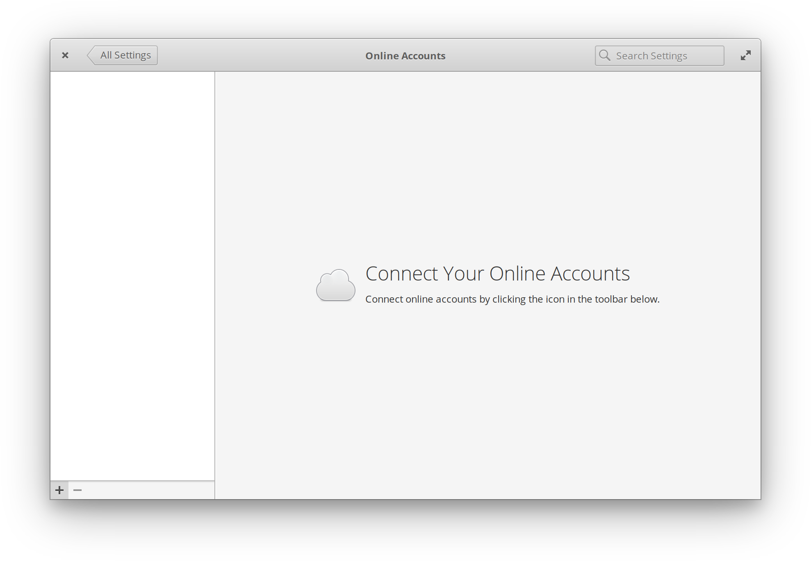

# elementary Online Accounts v3.0

## Contributions


If you like my contributions, [**❤️ Sponsor Me**](https://github.com/sponsors/marbetschar). It would mean the world to me!


* [x] [~~**Verify E-Mail Credentials**~~](https://github.com/elementary/switchboard-plug-onlineaccounts/pull/189) 
* [x] [~~**Add support for well known google folders**~~](https://github.com/elementary/switchboard-plug-onlineaccounts/pull/194) 
* [x] [~~**Configuring well known folder URIs**~~](https://github.com/elementary/switchboard-plug-onlineaccounts/pull/192) 
* [x] [~~**Popdown Popover when a button is clicked**~~](https://github.com/elementary/switchboard-plug-onlineaccounts/pull/193) 
* [x] [~~**Hide local_mbox account**~~](https://github.com/elementary/switchboard-plug-onlineaccounts/pull/190) 

[**more »**](../contributions.md#elementary-online-accounts)

## Built For

Users of the the Gtk based Linux Desktop distribution named [elementary OS](https://elementary.io/).

## Built With

* [Evolution Data Server](https://gitlab.gnome.org/GNOME/evolution-data-server)
* [Gtk](https://www.gtk.org/)
* [Vala](https://wiki.gnome.org/Projects/Vala/Tutorial)

## More Information

* [github.com/elementary/switchboard-plug-onlineaccounts](https://github.com/elementary/switchboard-plug-onlineaccounts)

