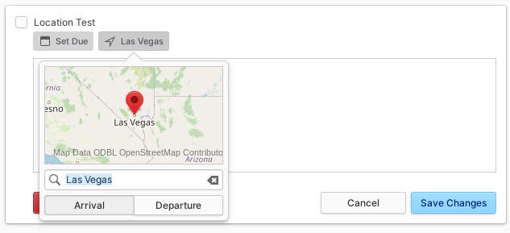

# elementary Tasks


If you like my work, [**❤️ Sponsor Me on GitHub**](https://github.com/sponsors/marbetschar). It would mean the world to me!


## Built For

Users who need to manage tasks on the Gtk based Linux Desktop distribution named [elementary OS](https://elementary.io/).

## Built With

* [Evolution Data Server](https://gitlab.gnome.org/GNOME/evolution-data-server)
* [Gtk](https://www.gtk.org/)
* [Vala](https://wiki.gnome.org/Projects/Vala/Tutorial)

## More Information

* GitHub Repository of elementary Tasks:

  [https://github.com/elementary/tasks](https://github.com/elementary/tasks)

