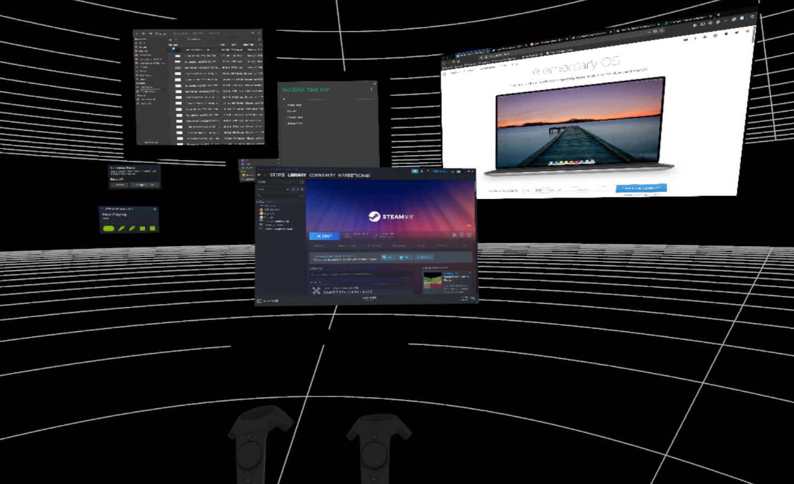

# Support for xrdesktop \(Virtual Reality\) in elementary

## Built For

Users who'd love to interact with the beautiful linux desktop of elementary in Virtual/Augmented Reality \(XR\).

## Contributions


If you like my contributions, [**❤️ Sponsor Me**](https://github.com/sponsors/marbetschar). It would mean the world to me!


This project has three parts which work together to create the elementary XR experience:

### Gala Plugin \(Window Manager plugin\)

A plugin for the elementary OS Window Manager which enables us to mirror the desktop windows to XR: [https://github.com/elementary/gala/pull/1095](https://github.com/elementary/gala/pull/1095)

### Wingpanel Indicator \(Top panel plugin\)

An indicator for the elementary OS top panel which provides a possibility to enable or disable window mirroring to XR: [https://github.com/marbetschar/wingpanel-indicator-xrdesktop](https://github.com/marbetschar/wingpanel-indicator-xrdesktop)

### Switchboard Plug \(System settings plugin\)

A plugin for the elementary OS system settings to enable the user to configure where and how desktop windows should be mirrored to XR: _Development not started yet._

## Built With

* [xrdesktop](https://gitlab.freedesktop.org/xrdesktop/xrdesktop) - A library for XR interaction with traditional desktop compositors.
* [Monado](https://gitlab.freedesktop.org/monado/monado) - The open source OpenXR runtime.
* [Gala](https://github.com/elementary/gala/) - The elementary OS Window Manager.
* [Wingpanel](https://github.com/elementary/wingpanel/) - The elementary OS top panel that holds indicators and spawns an application launcher.
* [Switchboard](https://github.com/elementary/switchboard/) - An extensible System Settings app designed for elementary OS.
* [Vala](https://wiki.gnome.org/Projects/Vala/Tutorial) - a modern programming language to write applications that run on the GNOME runtime libraries

