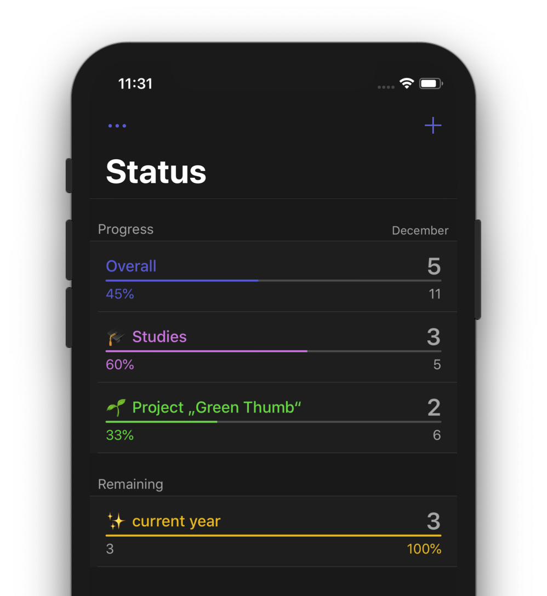

# Progress for Apple Reminders


If you like my work, [**❤️ Sponsor Me on GitHub**](https://github.com/sponsors/marbetschar). It would mean the world to me!


## Built For

Productivity enthusiasts looking to accomplish more using stock Apple Reminders.

## Built With

### iOS App

* [Swift](https://swift.org/getting-started/)
* [Xcode](https://developer.apple.com/xcode/)
* [Carthage](https://github.com/Carthage/Carthage)
* [Giphy](https://github.com/Giphy/giphy-ios-sdk-core/)

### Website

* [Jazzy](https://github.com/realm/jazzy)
* [GitHub Pages](https://pages.github.com/)
* [Jekyll](https://jekyllrb.com/)

## More Information

* Website of Progress for Apple Reminders:

  [https://progress.rocks/](https://progress.rocks/)

* Website of ProgressKit - the Framework powering the App, released as Open Source:

  [https://sdk.progress.rocks/](https://sdk.progress.rocks/)

