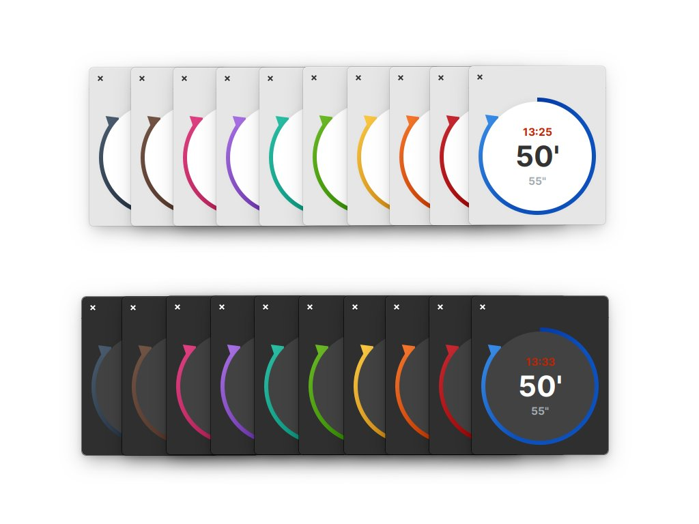

## Built For

Users who need to focus for a given time period on the Gtk based Linux Desktop distribution named [elementary OS](https://elementary.io/).

## Built With

- [Gtk](https://www.gtk.org/)
- [Vala](https://wiki.gnome.org/Projects/Vala/Tutorial)

## More Information

- GitHub Repository of Time Limit:
  https://github.com/marbetschar/time-limit

## Acknowledgements

* Designed by [Michael Villar](https://github.com/michaelvillar/timer-app)

