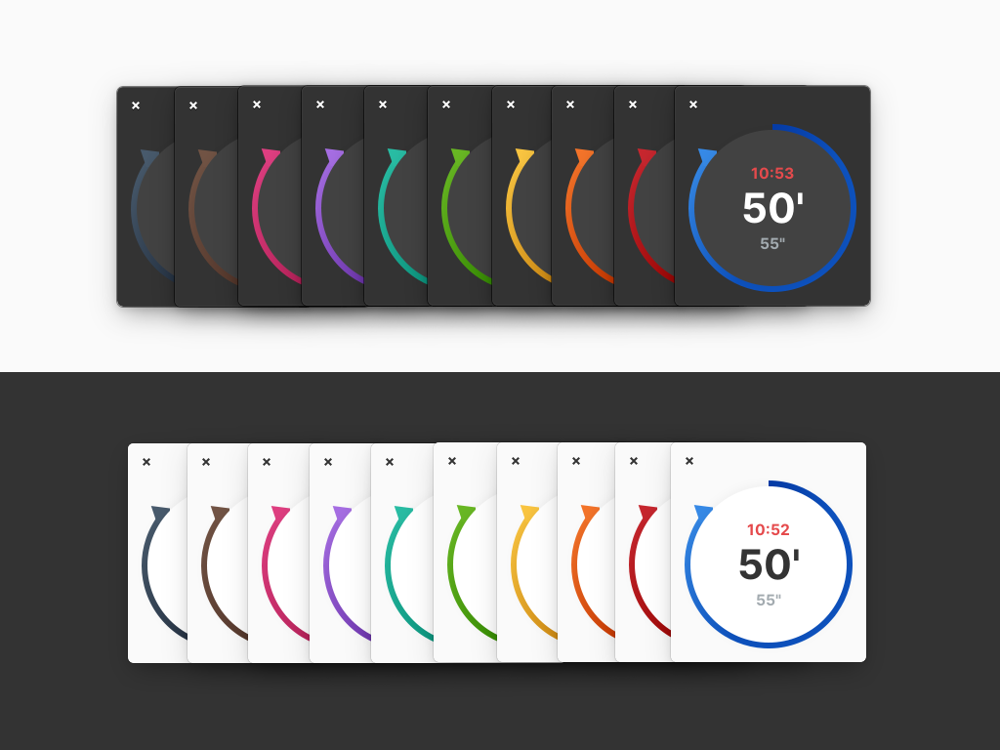

# Time Limit

## Contributions


If you like my contributions, [**❤️ Sponsor Me**](https://github.com/sponsors/marbetschar). It would mean the world to me!


* [x] [~~**Keep alive while timer runs**~~](https://github.com/marbetschar/time-limit/pull/56) 
* [x] [~~**Flatpak support**~~](https://github.com/marbetschar/time-limit/pull/46) 
* [x] [~~**Ditched libunity**~~](https://github.com/marbetschar/time-limit/pull/49) 
* [x] [~~**Use libhandy**~~](https://github.com/marbetschar/time-limit/pull/48) 
* [x] [~~**Color time and pause**~~](https://github.com/marbetschar/time-limit/pull/47) 

[**more »**](../contributions.md#time-limit)

## Built For

Users who need to focus for a given time period on the Gtk based Linux Desktop distribution named [elementary OS](https://elementary.io/).

## Built With

* [Gtk](https://www.gtk.org/)
* [Vala](https://wiki.gnome.org/Projects/Vala/Tutorial)

## More Information

* [github.com/marbetschar/time-limit](https://github.com/marbetschar/time-limit)

## Acknowledgements

* Original design by [Michael Villar](https://github.com/michaelvillar/timer-app)

