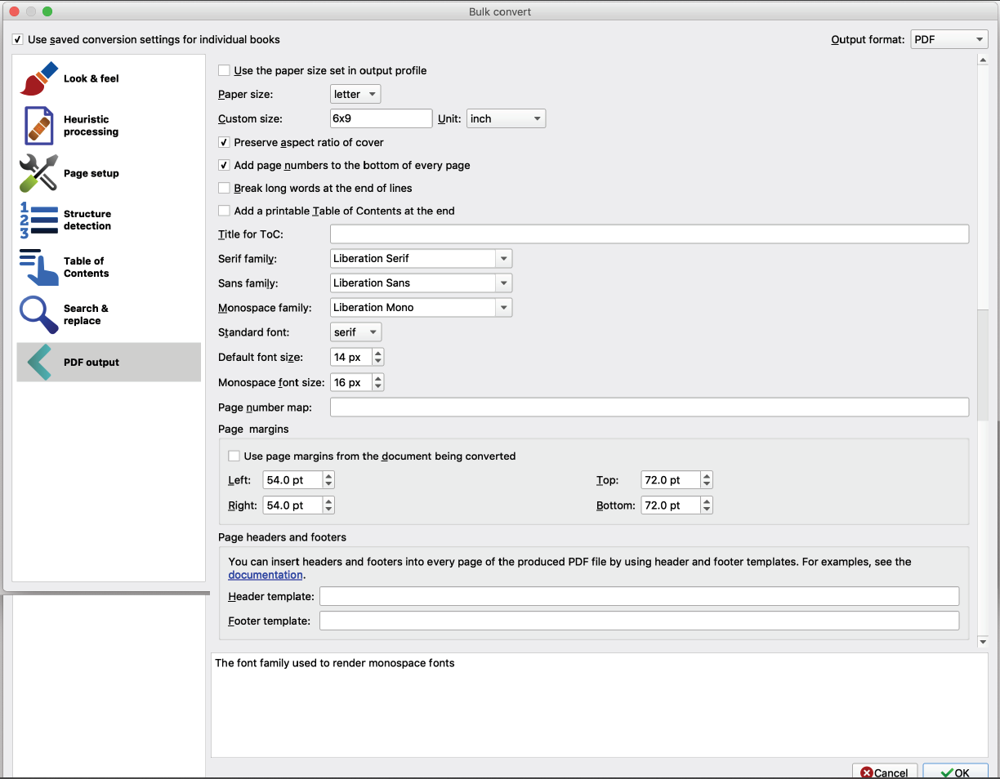

# Calibre ePub to PDF conversion settings

> 
> 

These settings are best practices for books. For details see: [en.wikibooks.org/wiki/Basic_Book_Design/Margins](https://en.wikibooks.org/wiki/Basic_Book_Design/Margins)


If you like my work, [**❤️ Sponsor Me**](https://github.com/sponsors/marbetschar). It would mean the world to me!


