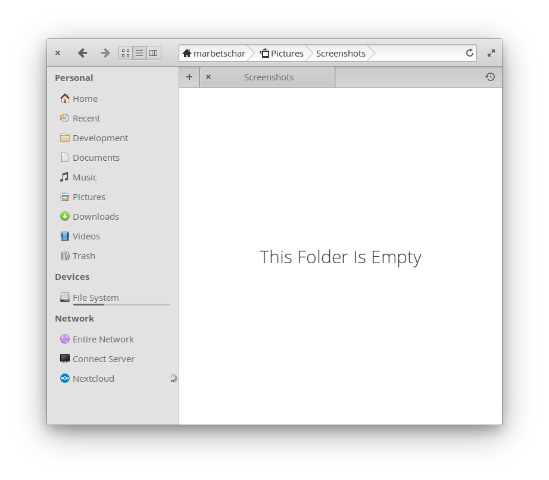

# Install Nextcloud Client

 


If you like my work, [**❤️ Sponsor Me**](https://github.com/sponsors/marbetschar). It would mean the world to me!




## Add Nextcloud client PPA

You need to add the Nextcloud client PPA to enable your elementary OS to actually find the needed packages. For this, open a Terminal and insert the following commands:

```text
sudo apt install software-properties-common    # installs the "add-apt-repository" command
sudo add-apt-repository ppa:nextcloud-devs/client
```

For more details see [the PPA's homepage](https://launchpad.net/~nextcloud-devs/+archive/ubuntu/client).

## Install Nextcloud client

_Don't worry, you only need to install Nextcloud client via Terminal - future updates will be handled graphically by the elementary OS AppCenter._

We are now ready to install the client. To do so, enter the following commands in your Terminal:

```text
sudo apt install nextcloud-client
```

And that's it. You successfully installed Nextcloud client on elementary OS. Start it up and configure it. Once you fully configured it, you'll fall in love with its integration into elementary's File Manager.

